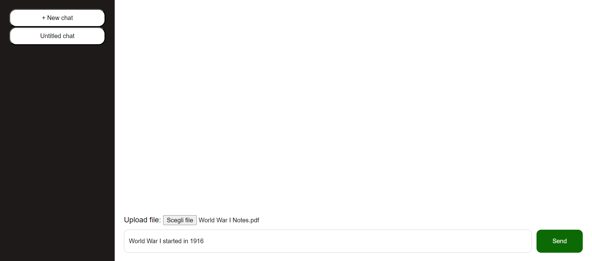
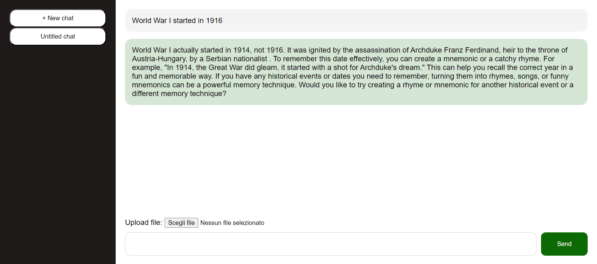

# MemorAI PoC

This repository contains the PoC of the MemorAI Web App.

It is a simple Flask + HTMX demo of chatting with PDF files using the OpenAI Assistants API.

**For the complete experience please take a look at the [Figma Prototype](https://www.figma.com/proto/SmXAPb2kiJrl2pfzdJqIPN/EduTech?page-id=2%3A2&type=design&node-id=56-116&viewport=776%2C431%2C0.1&t=Ol40D2t2lFumEehO-1&scaling=scale-down&starting-point-node-id=56%3A116&show-proto-sidebar=1&mode=design)**.

The OpenAI Assistants API is a powerful tool that enables the creation of custom AI assistants. These helpers, powered by OpenAI's advanced models and tools, such as File Search, are capable of handling various tasks like suggesting solutions, automating tasks, and providing personalized responses, while also supporting features like persistent threads and message history storage. You can find more information about the OpenAI Assistants API [here](https://beta.openai.com/docs/api-reference/assistants).

If you prefer to utilize your own OpenAI personal assistant rather than the default MemorAI one (which was created based on a simulated user), create a ```settings.json``` file with:
```
{
    "assistant_id": "<assistant_id>"
}
```
Otherwise the standard MemorAI assistant will be created.

## Quick Start

### Prerequisites
- Python 3.6 or higher
- OpenAI API Key

### Installation
Open a terminal and navigate to the project directory.

Optionally, create a virtual environment:
```
$ python -m venv venv
$ source venv/bin/activate
```

Install the dependencies and run the server:
```
$ pip install -r requirements.txt
$ export OPENAI_API_KEY=YOUR_API_KEY
$ flask run
```

## Example Usage
Here is an example of how to use the MemorAI Web App.

In the first image, during a chat with the assistant, the user uploads a PDF file and then provides incorrect information about the file content.


In the image below, you can see the assistant correcting the user and providing the correct information, along with a rhyme to help the user remember the incorrect information they provided.


## Other Functionalities
This demo was developed in a short period of time and has some limitations.

The use of Whisper AI for speech transcription to make the spoken interaction with the assistant possible is not implemented in this version.

You can find a PoC of a Node.js server containing the PoC of the use of the Whisper AI API for audio transcription [here](https://github.com/agnesetaluzzi/whisperAPI_gdsc/). It provides a REST endpoint that accepts a POST request with an audio file and returns the transcription of the audio file.
